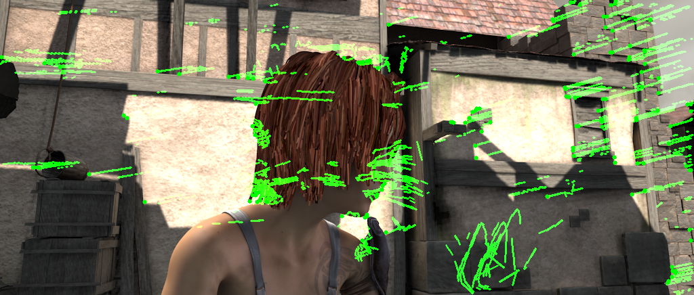
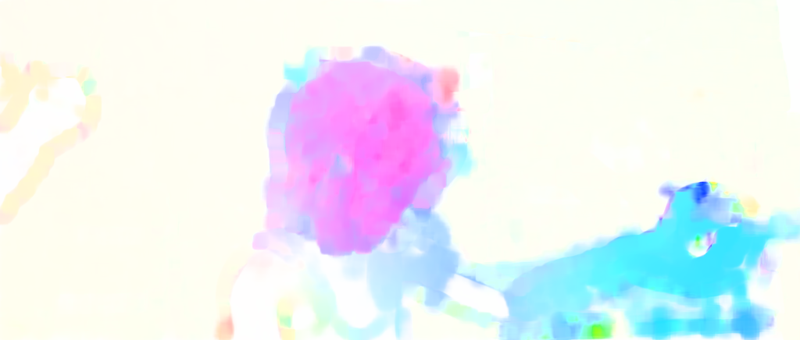
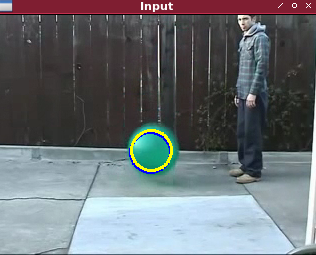
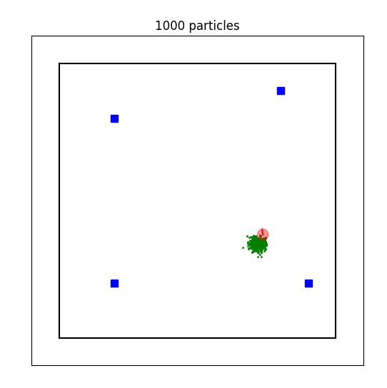

# Object-Tracking-Algorithms

Este repositorio academico tiene el objetivo de demostrar el funcionamiento de algoritmos de Seguimiento que pertenecen a las siguientes familias:
 <ul> <li>Optical Flow</li></ul>  
 <ul> <li>Kalman Filter</li></ul> 
 <ul> <li>Particle Filter</li></ul> 

## Autores

- [@alandgabriel](https://www.github.com/alandgabriel)

 
## Contenido del curso
| No.        | Algoritmo           | Familia | Código  |  Referencias|
| :-------------: |:-------------| :-------------|:-----:| :-----|
| 1.              |   Lucas Kanade       | Optical Flow |   <ul> <li>[Código Fuente](/opticalFlow/src/lk.py)</li></ul>    | <ul><li> [Artículo](https://cecas.clemson.edu/~stb/klt/lucas_bruce_d_1981_1.pdf) </li></ul>
| 2.              |  Farneback     | Optical Flow |   <ul> <li>[Código Fuente](/opticalFlow/src/farneback.py)</li></ul>    |  <ul> <li> [Artículo](http://www.diva-portal.org/smash/get/diva2:273847/FULLTEXT01.pdf)</li> </ul>
| 3.              |  Kalman Filter   | Stochastic Filter |   <ul> <li>[Código Fuente](/kalman-filter/src/main.py)</li> </ul>    |  <ul><li>[Artículo](https://www.unitedthc.com/DSP/Kalman1960.pdf) <li> [Desarrollo Matemático](http://140.113.144.123/EnD106/Bayesian%20filtering-%20from%20Kalman%20filters%20to%20Particle%20filters%20and%20beyond.pdf) </li></ul>
| 4.              |Particle Filter  | Stochastic Filter |   <ul> <li>[Código Fuente](/particle-filter/src/particle_filter.py)</li> </ul>    |  <ul><li>[Artículo](http://robots.stanford.edu/papers/fox.aaai99.pdf)<li> [Implementación de referencia](https://www.mdpi.com/1424-8220/21/2/438/pdf) <li> [Desarrollo Matemático](http://140.113.144.123/EnD106/Bayesian%20filtering-%20from%20Kalman%20filters%20to%20Particle%20filters%20and%20beyond.pdf) </li></ul> 


## Demo

Lukas Kanade

 

Farneback


  
Kalman Filter



Particle Filter



## Corre Localmente

Clona el proyecto

```bash
  git clone https://github.com/alandgabriel/Object-Tracking-Algorithms.git
```

Accede al directorio del proyecto

```bash
  cd Object-Tracking-Algorithms
```


Corre el Filtro Partícula
```bash
  python particle-filter/src/particle_filter.py
```

 Corre el Filtro de Kalman 
```bash
  python kalman-filter/src/main.py
```

Corre el algoritmo de Lukas Kanade
```bash
  python opticalFlow/src/lk.py
```

Corre el algoritmo de Farneback
```bash
  python opticalFlow/src/farneback.py
```
